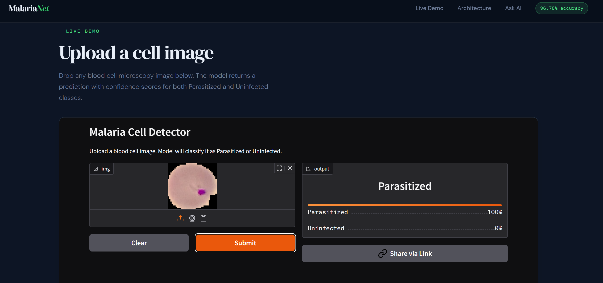
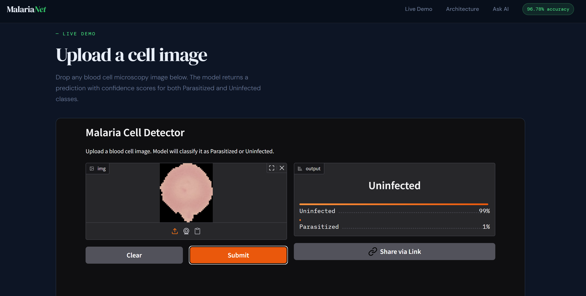

# 🦟 Malaria Cell Detection using Deep Learning

A deep learning web app that detects malaria-infected blood cells from microscopic images using a fine-tuned ResNet18 Convolutional Neural Network — with a built-in AI assistant powered by LLaMA 3.1.

## 🔗 Live Links

- 🌐 **Live Demo:** [malaria-detector-omega.vercel.app](https://malaria-detector-omega.vercel.app)
- 🤗 **HuggingFace Space:** [prophylaxis77/malaria-detector](https://huggingface.co/spaces/prophylaxis77/malaria-detector)

## 📸 Screenshots

### Parasitized Cell ⚠️


### Uninfected Cell ✅


## ✨ Features

- Classifies blood cell images as **Parasitized** or **Uninfected** in real time
- ResNet18 model fine-tuned using Transfer Learning on NIH dataset
- ~96.78% validation accuracy
- FastAPI backend for model inference
- Built-in **CellScan AI Chatbot** powered by LLaMA 3.1 via HuggingFace Router
- Deployed on Vercel and HuggingFace Spaces

## 🛠️ Tech Stack

**Frontend**
- HTML, CSS, JavaScript

**Backend**
- Python, FastAPI, httpx

**Deep Learning**
- PyTorch — model training and inference
- ResNet18 — pre-trained CNN architecture (Transfer Learning)
- torchvision — image preprocessing and transforms

**AI Chatbot**
- LLaMA 3.1 8B Instruct via HuggingFace Router API

## 📁 Project Structure

```
malaria-cell-detection/
├── model_code.ipynb        # CNN training, evaluation, and results
├── chatbotapi.py           # FastAPI backend for inference + AI chatbot
├── index.html              # Frontend interface
└── requirements.txt        # Python dependencies
```

## 🤖 Model Details

- **Dataset** — NIH Malaria Cell Images (27,558 images)
- **Classes** — `Parasitized` and `Uninfected`
- **Architecture** — ResNet18 pre-trained on ImageNet
- **Technique** — Transfer Learning (fine-tuned final layers)
- **Framework** — PyTorch
- **Validation Accuracy** — ~96.78%

## 🚀 Getting Started

### Backend (FastAPI)

```bash
git clone https://github.com/arpityadav21/malaria-cell-detection.git
cd malaria-cell-detection
pip install -r requirements.txt
```

Create a `.env` file and add your HuggingFace token:
```
HF_TOKEN=your_huggingface_token_here
```

Run the API:
```bash
uvicorn chatbotapi:app --reload
```

API will run on http://127.0.0.1:8000

### Frontend

Open `index.html` directly in your browser or serve it with any static server.

> **Dataset:** Download from [NIH Malaria Cell Images on Kaggle](https://www.kaggle.com/datasets/iarunava/cell-images-for-detecting-malaria)

## 🔗 How It Works

1. User uploads a blood cell image via the frontend
2. Image is sent to the FastAPI backend
3. ResNet18 model preprocesses and classifies the image
4. Result returned as **Parasitized** or **Uninfected** with confidence score
5. User can also chat with the CellScan AI assistant for project-related queries

## 👨‍💻 Author

**Arpit Yadav** — 2nd Year CSE Student
- GitHub: [@arpityadav21](https://github.com/arpityadav21)
